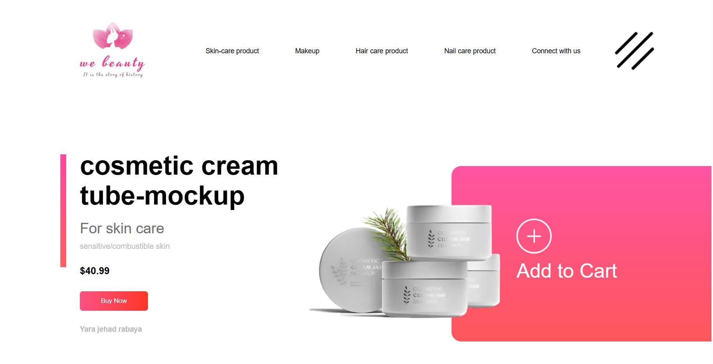

# Project Name: webeauty

### What is the goal of this website?
it is a Cosmetics-website .
The goal of this website is to display and sell skin care products
### 🌍 Live Demo :
[webeauty](https://webeauty.netlify.app/) - "Responsive for laptop and computer only"
### Authors:
* 	👩💻Yara Jehad Rabaya
### Adapted from:
*[Easy Tutorials](https://www.youtube.com/watch?v=lAOkx2yZESY) - "YouTube channel"
_______________________________________________________________________________________________________________________
### Project Type ?
Front end 
______________________________________________________________________________________________________________________
### Languages used?
###### HTML
###### CSS
###### NOTE: "Responsive for laptop and computer only"
_______________________________________________________________________________________________________________________
### Pictures of the website design:

